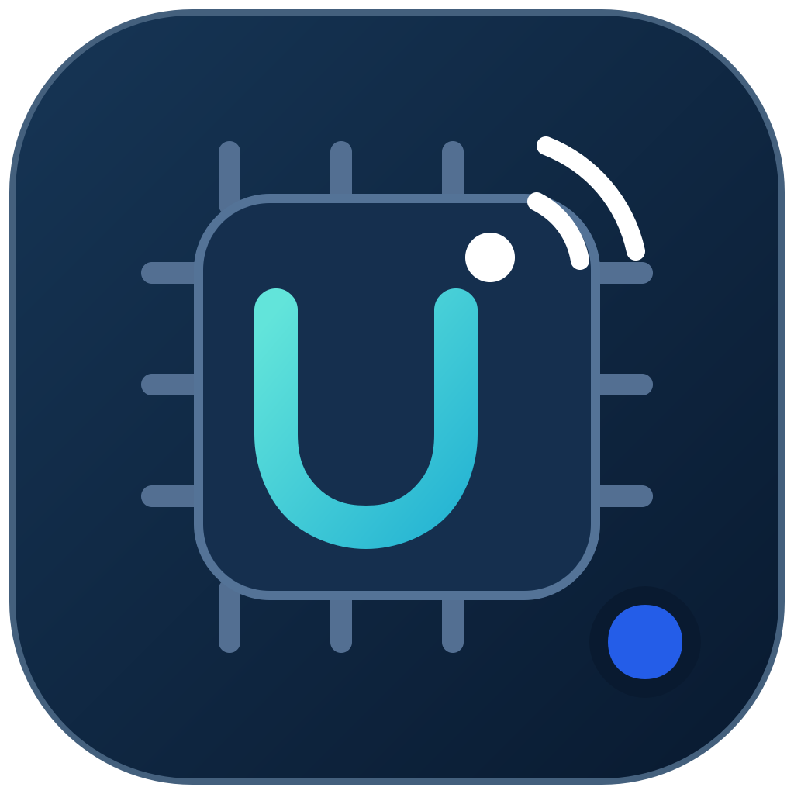

# UWB Board Programmer 2.0.1

A Windows desktop workspace for preparing Murata Type2BP / Type2DK EVKs, acquiring real UWB RF timestamps, computing 3D positions on the PC and forwarding accepted live positions to the RTLS Platform.

| Positioning mode | Hardware | Measurements |
| --- | --- | --- |
| TDoA + AoA, 3D | 3 Type2BP anchors + 1 Type2DK tag | Two RF time differences and verified azimuth/elevation |
| TDoA, 3D | 4 Type2BP anchors + 1 Type2DK tag | Three RF time differences; no AoA used |

Four-anchor 3D TDoA requires non-coplanar surveyed anchor positions. Four receivers are a minimum configuration: ambiguous roots, poor geometry, stale clocks and excessive uncertainty are rejected. The USB arrival time is never used as the RF arrival timestamp.

The interface switches between **English and ไทย**. Device assignments, geometry, RF clocks, local recording, offline replay and RTLS publishing adapt to the selected mode. The default interface language is English; subsequent choices are saved in new local settings files.

## Open on the prepared PC

Double-click **UWB Board Programmer 2.0.1** on the desktop, or `Start_UWB_Board_Programmer_v3.cmd` in this folder. Keep the release inside this workspace so it can find firmware bundles, assets and local tools.

## Guides

- [English user guide](docs/USER_GUIDE_EN.v2.md)
- [คู่มือภาษาไทย](docs/USER_GUIDE_TH.v2.md)
- [Build and local vendor inputs](docs/BUILD_EN.v2.md)
- [Architecture and measurement assumptions](docs/ARCHITECTURE_EN.v1.md)

## Source and local data

The active source is `app/revisions/v4`. Earlier revisions remain available for review. The original project folder and RTLSSimulator are preserved. Profiles, language choices, recordings, flash logs and credentials are stored locally in new files. Gateway tokens use Windows DPAPI.

This repository contains application source, custom host firmware source, tests, documentation and the original editable vector logo. Vendor SDKs, programmer binaries, compiler, generated firmware, executable packages and user data are excluded from Git. Supply the locally licensed vendor inputs described in the build guide to rebuild firmware.

**Validation:** software tests and compilation are separate from hardware validation. Flashing the EVKs, RF timing/AoA axes, battery operation and live positioning on RTLS still require tests with real boards. No synthetic or replay positions are published by the normal application.

Single-board flashing accepts only the selected board's COM port and revision. Other boards may be unplugged, and the same COM port may be reused after each completed operation. Surveying is required for live positioning, not for firmware preparation.
