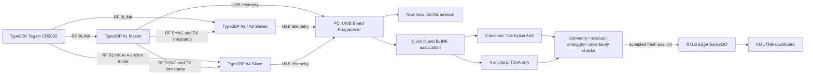

# UWB Board Programmer — Architecture

The application has five pages: device/firmware preparation, survey/calibration, live acquisition, RTLS connection and local recording/replay. The model and controller use the configured anchor count throughout. Changing mode is blocked while COM/cloud are active; acquisition uses its own profile copy. The Tag moves to the row after the last anchor when the mode changes.

Firmware telemetry carries integer RF RX timestamps, 64-bit Master TX timestamps, peer MAC, frame type, counter, boot identifier, measurement status and optional angles/FOM/NLOS. The parser rejects float representations of full RF timestamps. Wrapped 40-bit timestamps are unwrapped before clock correction; epochs remain integers and only relative deltas enter floating arithmetic.

Slave clocks use a sliding affine fit from RF SYNC. The flight time from surveyed Master-to-Slave distances is included, and the configured RX bias is applied once when correcting measurements. Clocks require six samples, a sufficient time span, bounded drift, low residual and recent SYNC. USB arrival timestamps are used only for freshness/timeouts. Receiver resets invalidate pending associations and synchronization.

For receiver i relative to the Master 0, the measured distance difference is

`delta_i = (corrected_rx_i - corrected_rx_0) * TICK_S * C_M_S`.

The solver minimizes weighted residuals of

`norm(x - anchor_i) - norm(x - anchor_0) - delta_i`.

Hybrid mode also includes wrapped azimuth and elevation residuals from verified calibrated anchors. Pure four-anchor mode deliberately excludes every AoA observation. Non-coplanar coordinates are required for the selected four-anchor 3D implementation. Its three TDoAs can still admit two physical roots; both analytic roots and bounded numerical starts are considered. A previous fix is only a starting guess and does not silently resolve ambiguity. The workspace is a measured prior, not an artificial height substitution.

Fixes are rejected for physical baseline violations, rank/conditioning, residual disagreement, distinct plausible minima or excessive horizontal/Z covariance estimates. The estimated 95% uncertainties rely on the noise model and local linearization; they are not empirical confidence claims under multipath/NLOS. The current weighting retains the previous pairwise sigma model and does not model full cross-correlation from a shared Master timestamp. Measure real performance and improve that model if required.

Publishing validates Gateway token scope, site/floor and every configured Anchor's surveyed coordinates. Live positions use the actual `num_anchors_used`. Replay remains local. Heartbeat/status/raw/position packets use the existing Edge contract, with acknowledgements and freshness checks. The application cannot prove external dashboard rendering without live boards and an actual Gateway token.

English source/protocol values remain stable. A presentation catalog localizes widget labels, placeholders, messages and navigation; IDs, MACs, roles, paths, units and numerical values are not translated. New language settings files include an increasing sequence so rapid toggles on Windows do not select an older preference with the same clock stamp.
